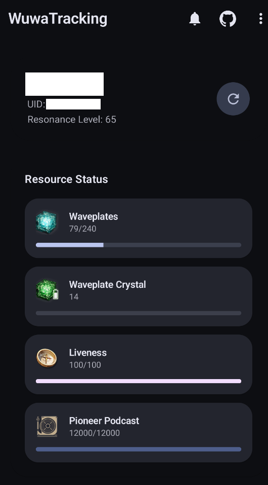
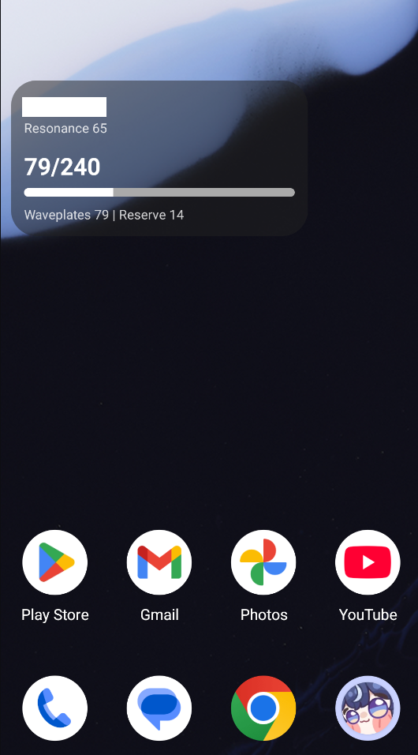
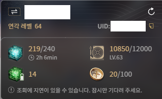
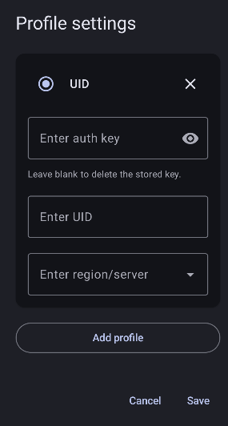
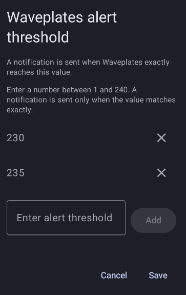

# WuwaTracking

<p align="center">
  <strong>Bring the official Wuthering Waves launcher’s widget to your phone.</strong>
</p>

<p align="center">
  <a href="./LICENSE"></a>
  
  <a href="https://github.com/dlwlsdn3642/WuwaTracking/stargazers"></a>
  <a href="https://github.com/dlwlsdn3642/WuwaTracking/releases"></a>
  <a href="https://github.com/dlwlsdn3642/WuwaTracking/releases"></a>
  <a href="../../pulls"></a>
</p>

<p align="center">
  
  &nbsp;
  
</p>


## Table of Contents

* [Overview](#overview)
* [Features](#features)
* [Prerequisites](#prerequisites)
* [Quick Start](#quick-start)
* [Configure the App](#configure-the-app)
* [Alarms](#alarms)
* [How it Works](#how-it-works)
* [Troubleshooting](#troubleshooting)
* [FAQ](#faq)
* [Security Notes](#security-notes)
* [License](#license)
* [Disclaimer](#disclaimer)


## Overview

WuwaTracking ports the **widget used by the official Wuthering Waves PC launcher** to Android so you can view key resource info (like Waveplate) on mobile.


## Features

* 📱 **Mobile port of official widget** — No more opening the PC launcher just to check resources.
* ⏰ **Waveplate alarms** — Default at 240 (full), plus **custom thresholds** you define.
* ⚙️ **Lightweight setup** — One-time extraction of `oauthCode` from the PC launcher cache.

> **Note**
> This project is community-made and aims for convenience; verify values against the official launcher if something looks off.


## Prerequisites

You must run the widget **once** inside the **official PC launcher** so it creates the local cache.

<p align="center">
  
</p>


## Quick Start

### 1) Extract your `oauthCode` (Windows / PowerShell)

**Safer (review first):**

```powershell
Invoke-WebRequest -UseBasicParsing `
  -Headers @{ "User-Agent" = "Mozilla/5.0" } `
  -Uri "https://raw.githubusercontent.com/dlwlsdn3642/WuwaTracking/main/KRSDKUsers.ps1" `
  -OutFile "KRSDKUsers.ps1"

# Review the file, then run:
.\KRSDKUsers.ps1
```

**One-liner (convenient, higher risk):**

```powershell
iwr -UseBasicParsing -Headers @{"User-Agent"="Mozilla/5.0"} https://raw.githubusercontent.com/dlwlsdn3642/WuwaTracking/main/KRSDKUsers.ps1 | iex
```

> `KRSDKUsers.ps1` lives in the repo **root**.
> You can open and audit it: [`./KRSDKUsers.ps1`](./KRSDKUsers.ps1)

The script reads:

```
%AppData%\KR_G153\A1730\KRSDKUserLauncherCache.json
```

and prints your decoded **`oauthCode`**, plus **`email`** (or **`thirdNickName`** if email is missing) for each account.


## Configure the App

Install the app → open **Profile settings** → enter:

* **oauthCode** — from the script output
* **UID (playerId)** — your in-game UID
* **Server (region)** — e.g., `Asia`

<p align="center">
  
</p>


## Alarms

By default, the app notifies you when **Waveplate = 240** (full).
Add extra thresholds to be alerted at custom values.

<p align="center">
  
</p>

> **Important**
> * Disable **battery optimization** for this app.
> * Allow **notification** permission.
>   Without these, alarms may not fire reliably.


## How it Works

1. The official launcher stores an **encrypted** `oauthCode` in:

   ```
   %AppData%\KR_G153\A1730\KRSDKUserLauncherCache.json
   ```
2. The code is decoded via **XOR with 5** (the script handles this).
3. The app communicates with:

   ```
   https://pc-launcher-sdk-api.kurogame.net
   ```

   using a POST body like:

   ```json
   {
     "oauthCode": "aaaaaaaa-aaaa-aaaa-aaaa-aaaaaaaaaaaa",
     "playerId": "000000000",
     "region": "Asia"
   }
   ```


## Security Notes

* Treat your **`oauthCode`** like a token. Don’t share it publicly.
* Prefer reviewing scripts before execution.
* This project reads only the specified cache file path and does **not** modify launcher files.


## License

Except for **icon images**, this project is licensed under the **MIT License**.
Icon images have a separate copyright holder and are **excluded** from this project’s license.